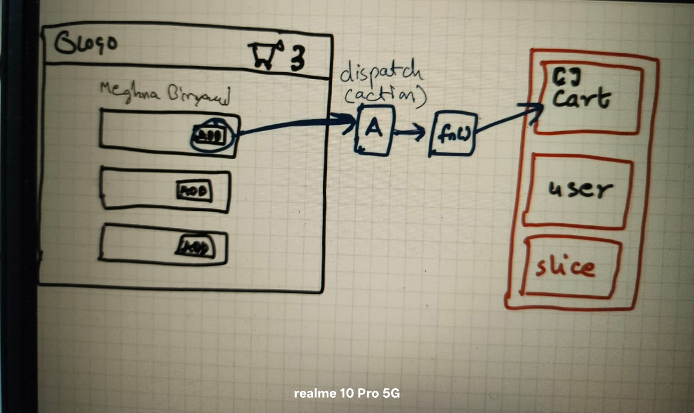
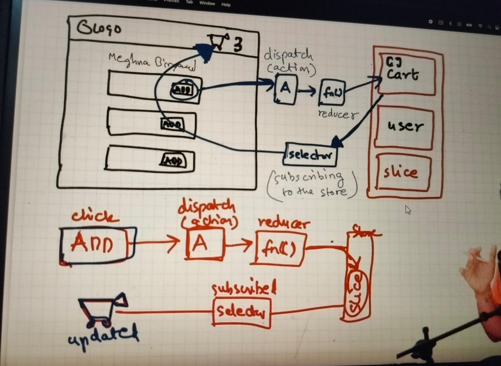

# Redux

redux is not mandatory

it is used in large scale application

redux is not only library Zustand is similar like redux for state management

redux is not part of react

we will use 2 library

- react-redux
- redux toolkit

# Store

redux Store is a large js object which stores every state

and it kept at central global space

# Slices

parts of the redux store is called slices

one store can have multiple slices i.e multiple parts

it is basically logicall partition of the store

E.g. for our food ordering app

- slice for cart data
- slice for loggedin user
- slice for theme (dark/light mode)

so this is slice, logical paratition of the store

- React says that you can't directly modify slice (i.e store)
  we need to dispatch our action which would execute a function which will update the store

- In our food ordering app
  when user click on "add to cart" btn a action would be dispatched which will calls a function
  and that function will update the slice of the store which is related to cart

 # in above case function that updates the store is called REDUCER

# Reducer

when "add to cart" btn is clicked it dispatches the action and calls reducer function

and reducer function will update the cart(slice of store)

# To read data form store -> for that we uses selector



# Selector

it will read data from the store and it will update the react component

# subscribing to the store

when data in store changes react automatically update the component to show new updated data i.e called subscribing to the store

how we subscribe the store -> with selector



# Redux use case 
step 1: configure store
```
import { configureStore } from "@reduxjs/toolkit";

const appStore = configureStore({});
export default appStore;
```
step 2: wrap the entire app with provider

```
import { Provider } from "react-redux";
import appStore from "./utils/appStore";

<Provider store={appStore}>
  <App/>
</Provider>
````
Question?
why configureStore is imported from @reduxjs/toolkit and Provider from react-redux
ANS:-> because creating store is a of reduxjs/toolkit and Provider helps to provide store to entire application
        so it is a react functionality

step 3: Create slice
slice will have intialState and reducers function which will helps to update the state
```
import { createSlice } from "@reduxjs/toolkit";

const cartSlice = createSlice({
  name: "cart",
  initialState: {
    items: [],
  },
  reducers: {
    addItem: (state, action) => {
      state.items.push(action.payload);
    },
    removeItem: (state, action) => {
      state.items.pop();
    },
    clearCart: (state) => {
      state.items.length = 0;
    },
  },
});

export default cartSlice.reducer;
export const { addItem, removeItem, clearCart } = cartSlice.actions;
```

step 4: How to read store data
subscribing the store using a selector
```
import {useSelector} from "react-redux";
const cart = useSelector((store)=>store.cart.items);
```

step 5: how to add item in store (dispatch action)
```
import {useDispatch} from "react-redux";
import {addItem} from "../utils/cartSlice"

const dispatch = useDispatch(); 
const handleitem =()=>{
  dispacth(addItem("pizza"))

}
```

# Interview Question

1. while subscribing store using selector
```
1.
const cartItem = useSelector((store)=>store.cart.items)
```
```
2.
const store = useSelector((store)=>store)
const cartItem = store.cart.item
```
both the code is same but\
In case 1 we are only subscribing to cart.items and In case 2 we are subscribing to entire store\
since store has many slices you change in any slice will update the component in case 2\
case 1 is optimized because it will only update when cart slice store is getting updated.\
always subscribe to smaller portion\

2. 
